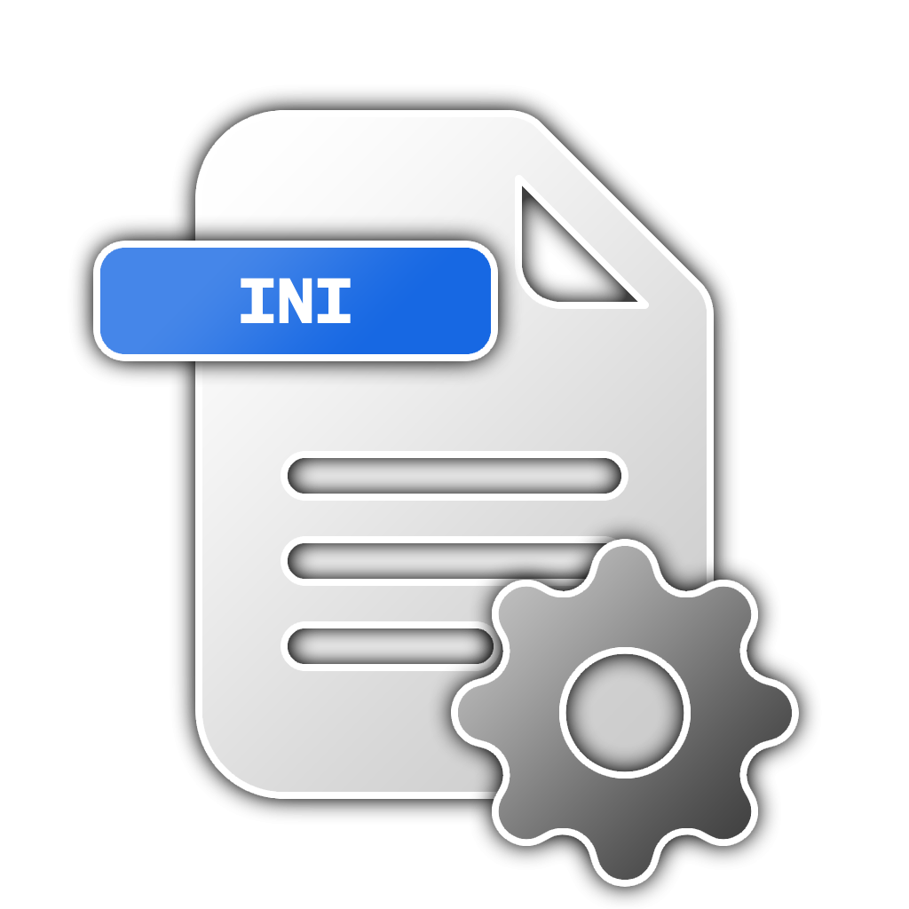

#  coreIRC

## Description
**coreIRC** is a lightweight, Python-based IRC solution that includes both **server** and **client** code.
- The **server** provides features like multiple channel support, user authentication (including token-based logins), and ping-pong keepalives.
- The **client** offers a command-based interface (with optional integration of `prompt_toolkit`) for smooth interaction, letting users join channels, chat, broadcast announcements, and more.

The entire codebase can be forked and modified to build out more advanced IRC functionality, or integrated with other systems needing real-time messaging.

## Features
- **Multi-Channel Server**: Users can create and join multiple channels (e.g. `LOUNGE`, `MAIN`), each isolated for separate conversations.
- **Token or Password Auth**: Seamlessly support credentials either via `/LOGIN` or `/TOKEN`.
- **Kick & Stop Commands**: Administrative commands like `/KICK` a user or `/STOP` the server gracefully.
- **Ping/Pong**: Automatic keepalive to remove stale or unresponsive connections.
- **Console**: A built-in server console (via `prompt_toolkit`) for real-time admin commands (`/STOP`, etc.).
- **Optional Client-Side Prompt**: A Python client that can track channel and username locally, and interpret server’s responses.

## Technology Stack
- **Python**: Core server/client logic using Python’s socket and threading capabilities.
- **prompt_toolkit** (optional): For advanced console and line-editing features on both server console and client.
- **bcrypt**: Used for secure password hashing (if password-based logins are enabled).
- **MySQL**: For user authentication and role/permission storage (if configured).

## License
This software is distributed under the [MIT](LICENSE) license.

## Security
Please disclose any vulnerabilities found responsibly – report security issues to the maintainers privately. See [SECURITY.md](SECURITY.md) for more information.

## Contributing
Contributions to coreIRC are welcome! If you have ideas for new features or have found bugs, please open an issue or submit a pull request.

### How to Contribute
  - **Fork the Repository**: Create a fork of the repository on GitHub.
  - **Create a New Branch**: For new features or bug fixes, create a new branch in your fork.
  - **Submit a Pull Request**: Once your changes are ready, submit a pull request to the main repository.

## Wait, where is the documentation?
Review the [Documentation](https://laswitchtech.com/en/blog/projects/coreIRC/index) for usage guides, command references, and advanced server/client configuration details.

## What about the download button?
If release binaries or packaged scripts are available, you can find them [here](https://github.com/LaswitchTech/coreIRC/releases/latest). Otherwise, clone the repo and run directly via Python.

## GitHub Stats

